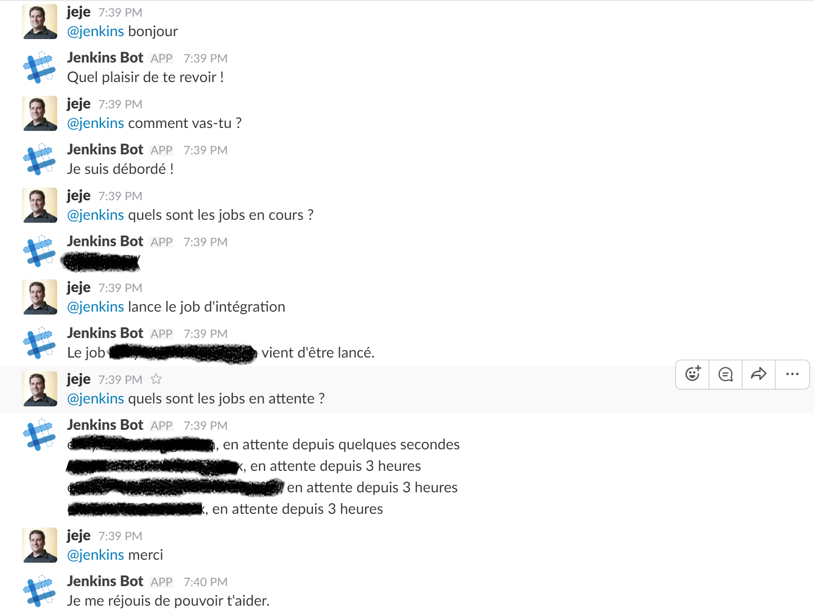

# jenkins-bot
Bot intelligent permettant de discuter avec Jenkins via Slack.

Exemple de chat possible avec le bot :

# Utilisation

## API.ai

Ce bot s'appuie sur [API.ai](https://api.ai).

Un export du projet est disponible dans le fichier api-ai-jenkins-bot.zip.

Il faut créer un nouvel agent dans API.ai et importer la configuration depuis
le ZIP mentionné.

## Google Cloud Functions

Le bot API.ai fait des appels à une fonction déployée dans Google Cloud Functions.

Vous devez éditer les champs nécessaires du fichier index.js.

Ensuite il faut mettre à jour dans la partie *Fullfillments* de API.ai l'URL
vers votre fonction déployée.
